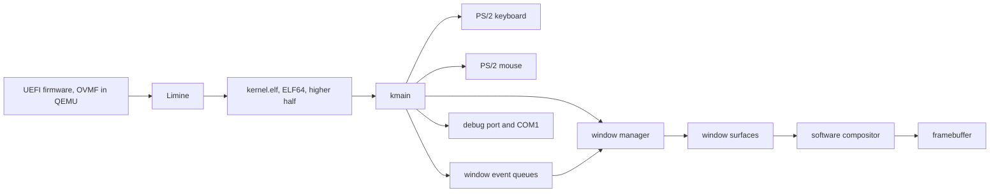

# ME OS architecture

Small on purpose. Each milestone adds one capability, and nothing is built
before a milestone needs it.

## Boot path

1. The firmware starts `EFI/BOOT/BOOTX64.EFI`, which is Limine.
2. Limine reads `boot/limine/limine.conf`, loads `boot/kernel.elf`, sets up long
   mode and a linear framebuffer, and jumps to `kmain`.
3. The kernel checks the Limine base revision and the framebuffer response,
   refuses to continue if either is missing, then draws.

The kernel is linked at `0xffffffff80000000`, the top 2 GiB, which is what
`-mcmodel=kernel` generates code for. `linker.ld` keeps the Limine request
structures in their own segment with `KEEP`, because nothing in the kernel
references them and `--gc-sections` would otherwise discard them.

## Modules

| Module | Responsibility |
| --- | --- |
| `main.c` | Demo logic, window/surface setup, presentation and device-to-event translation |
| `fb.c` | checked linear framebuffer access and presentation of a composed surface |
| `font.c` | 5x7 bitmap glyphs for A to Z, 0 to 9 and space |
| `kbd.c` | polled PS/2 keyboard, scancode set 1, with shift and the arrow keys |
| `mouse.c` | polled PS/2 mouse: port I/O, packet assembly, and pure decoding |
| `pointer.c` | where the pointer is, and clamping it to the screen |
| `cursor.c` | drawing the compositor-owned cursor overlay into a surface |
| `timer.c` | elapsed time, polled from the programmable interval timer |
| `rect.c` | rectangle timing, wrapping, hit testing and pointer-drag state |
| `calc.c` | parsing and evaluating a typed sum, conditional or assignment, with checked arithmetic |
| `vars.c` | a fixed table of eight named whole numbers |
| `fpu.c` | turning SSE on, and nothing else: no arithmetic lives here |
| `geometry.c` | sine, cosine, rotation and the turning triangle. The only file with floating point in it |
| `window.c` | stable window IDs, bounded lifetime, geometry, z-order, focus and input routing |
| `event.c` | bounded per-window event FIFO with explicit overflow accounting |
| `surface.c` | externally backed local pixel drawing, clipping and opaque blits |
| `compositor.c` | desktop clear and bottom-to-top composition of window surfaces |
| `log.c` | diagnostics to QEMU's debug port and to COM1 |
| `mem.c` | memset, memcpy, memmove, memcmp |

`mem.c` exists because GCC emits calls to those four on its own, even with
`-ffreestanding` and even when the source never names them. Without them the
kernel links today by luck and stops linking the moment a future milestone
writes ordinary looking C.

## Decisions worth knowing

**No interrupts yet.** There is no interrupt descriptor table, so an IRQ would
triple fault the machine. Interrupts stay masked, and both the keyboard and the
mouse are polled. The controller's status register says which device a waiting
byte came from, so the two share one port without stealing each other's bytes.
An IDT arrives when a milestone actually needs it.

**Input state is separate from input effects.** `kbd.c` and `mouse.c` talk to
the hardware and decode device data, `pointer.c` holds the desktop position,
and `main.c` translates that state into window events. `window.c` hit-tests,
changes focus and z-order, converts mouse coordinates to window-local ones and
routes keyboard events only to the focused queue. Demo then consumes only its
own queue and applies its rectangle/calculator behavior. The drivers do not
know what a window or rectangle is. Decoding, clamping, queues, hit testing,
focus and routing are tested on an ordinary machine.

**Arithmetic refuses rather than wraps.** Every operation in `calc.c` is
checked before it happens: addition and subtraction against the limits,
multiplication by dividing the limit rather than by multiplying and looking at
the result afterwards, division against zero and against the one case whose
answer will not fit, and powers by repeating a checked multiplication. Checking
afterwards was tried first and did not work: signed overflow is undefined, so
the compiler was entitled to delete the check that was meant to catch it, and it
did. The host tests caught that.

**Variables are stored only once the whole line has parsed.** `calc.c` reads an
assignment, works out the value, and remembers the name. `calc_evaluate` does
the storing, after it has checked that nothing is left over at the end. Storing
as soon as the assignment parsed was tried first, and it meant `X=5 6` stored 5
and then reported an error, which is the worst of both. A line that is refused
now leaves the table exactly as it was.

**Floating point is confined to one file, and the build checks it.** x86-64
guarantees SSE2, so that is what the kernel uses; x87 and AVX are not used at
all. The processor starts with floating point disabled, and there is no
interrupt table to catch a fault, so an SSE instruction executing before CR0 and
CR4 have been set would simply stop the machine. Everything is therefore
compiled with SSE off except `geometry.c`, whose entire public interface takes
and returns integers so that no other file can pass it a double even by mistake.
`make` disassembles every object and refuses to link if an SSE instruction
appears anywhere but `geometry.o`, because a rule nothing enforces is a rule
that quietly stops being true.

`fpu.c` holds the control register work and no arithmetic. `geometry.c` holds
the arithmetic and knows nothing about control registers. The drawing is done
in software into Demo's surface and copied by the compositor: there is no
graphics acceleration anywhere in this kernel.

**Time comes from a counter, not from the loop.** The PIT's channel 0 counts
down and wraps about every 55 milliseconds. The loop reads it, adds up the
differences, and hands the total to `rect_advance`, so the rectangle moves at
sixty pixels a second on a fast machine and on a slow one. The wrap arithmetic
is a pure function, because getting it wrong makes time jump backwards once per
wrap, which is exactly the kind of fault that hides in a short look at an
emulator. The leftover time between whole pixels is carried, so a thousand small
steps land where one large step would.

**The cursor is a compositor overlay.** M14 draws the arrow last into the
composed desktop surface, after every window. Pointer movement asks for another
presentation. Apps neither own the cursor nor need to hide it before updating
their surfaces, and the old direct-framebuffer saved-patch scheme is gone.

**Window identity is separate from storage.** M13 has no allocator to build on,
so `window_manager` uses eight fixed slots. Callers never name those slots:
they create, retrieve, raise and destroy windows through stable `WindowId`
values and an explicit z-order. This is a bounded implementation stepping
stone, not a claim that the kernel has dynamic memory. A future allocator can
replace the storage without changing the public lifetime rules.

**Apps draw locally; the compositor owns presentation.** Each window may attach
an opaque `surface` with dimensions equal to its geometry. Drawing primitives
take local signed coordinates and clip at the surface boundaries. Demo owns all
existing text, rectangle, calculator and triangle content. System owns a
separate coloured surface. Neither is given a framebuffer pointer.

`compositor_compose` clears the desktop, walks the manager's explicit
bottom-to-top order, skips minimized windows and clips each opaque blit against
the desktop. The cursor is applied after the windows, and `fb_present` is the
single path from that composed surface into the linear framebuffer. Attached
surfaces currently prevent geometry resizing; M17 must define replacement
backing-store semantics explicitly.

There is still no allocator. Desktop, Demo and System use bounded static pixel
stores, just as window objects use a bounded pool. The API separates surfaces
from their backing memory so allocator-backed stores can replace these arrays
without letting apps draw arbitrary framebuffer regions.

**Events belong to windows, not devices.** Every window contains a 32-entry
FIFO of `window_event` values. The current reliable set is mouse move/down/up,
key down and focus gained/lost. Queue overflow drops the newest event and
increments an observable counter; it never corrupts or silently reorders old
input. A click targets the topmost visible window, focuses and raises it, and
captures subsequent pointer events through release. A background click clears
focus. Destroying a window also clears capture and makes its queued events
unreachable through the invalidated stable ID.

Keyboard releases are not exposed yet because the scancode decoder does not
reliably produce them; the event API does not claim information the input
stack discards. There is still no process or app-owner model. Queue ownership
is attached to a window now so a future app boundary does not have to expose
raw device drivers.

**Framebuffer assumptions are checked, not assumed.** `fb_init` refuses a null
address, a bits per pixel other than 32, a zero dimension, a pitch smaller than
one row, or a pitch that is not a multiple of four. It packs colours from the
framebuffer's own channel masks rather than assuming `0xRRGGBB`. Every pixel
write is clipped.

**Two log sinks.** Port `0xE9` is QEMU's debug console and is inert on real
hardware. COM1 at `0x3F8` is a real serial port, so the same log will be visible
on a physical machine or through `qemu -serial`. Serial writes spin a bounded
number of times, so a missing UART cannot hang the boot.

**Window chrome is the next boundary.** M15 completes the first input-routing
path, but windows still have no visible manager-owned frame, title bar, close
control or whole-window drag behavior. M16 adds those without confusing Demo's
existing app-local rectangle drag with movement of the window itself. Resizing
remains M17 because it first needs explicit replacement backing-store semantics.

## Testing without a screen

`make test` runs `scripts/boot-capture.sh`, which boots the ISO with no display,
captures the framebuffer through the QEMU monitor, injects keyboard and mouse
input, and quits. `tests/check_boot.py` reads the captures as pixel data and
checks every completed visual milestone: text, arithmetic, the cursor, timed
movement, steering, wrapping, dragging and the rotating triangle. It samples
desktop, Demo and System pixels at known regions to prove opaque overlap and
z-order, captures both focus targets to prove click-to-raise, and checks both
log sinks for the kernel's own record of those actions.

That is a real check of what the kernel drew, not just that it compiled. It
still does not replace a person watching it boot once.

## What is deliberately absent

No memory manager, no processes, no filesystem, no drivers beyond the keyboard,
no networking, no shell, no agent integration. Each of those arrives when a
milestone requires it, not before.
