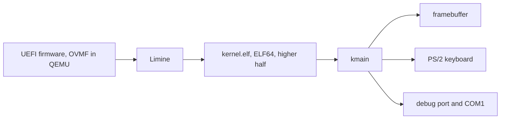

# ME OS architecture

Small on purpose. Each milestone adds one capability, and nothing is built
before a milestone needs it.

## Boot path

1. The firmware starts `EFI/BOOT/BOOTX64.EFI`, which is Limine.
2. Limine reads `boot/limine/limine.conf`, loads `boot/kernel.elf`, sets up long
   mode and a linear framebuffer, and jumps to `kmain`.
3. The kernel checks the Limine base revision and the framebuffer response,
   refuses to continue if either is missing, then draws.

The kernel is linked at `0xffffffff80000000`, the top 2 GiB, which is what
`-mcmodel=kernel` generates code for. `linker.ld` keeps the Limine request
structures in their own segment with `KEEP`, because nothing in the kernel
references them and `--gc-sections` would otherwise discard them.

## Modules

| Module | Responsibility |
| --- | --- |
| `main.c` | milestone logic: what gets drawn, and the input loop |
| `fb.c` | linear framebuffer: clear, fill a rectangle, draw a string |
| `font.c` | 5x7 bitmap glyphs for A to Z, 0 to 9 and space |
| `kbd.c` | polled PS/2 keyboard, scancode set 1 |
| `mouse.c` | polled PS/2 mouse: port I/O, packet assembly, and pure decoding |
| `pointer.c` | where the pointer is, and clamping it to the screen |
| `cursor.c` | drawing the cursor, and putting back what it covered |
| `timer.c` | elapsed time, polled from the programmable interval timer |
| `rect.c` | where the moving rectangle is, given how much time has passed |
| `log.c` | diagnostics to QEMU's debug port and to COM1 |
| `mem.c` | memset, memcpy, memmove, memcmp |

`mem.c` exists because GCC emits calls to those four on its own, even with
`-ffreestanding` and even when the source never names them. Without them the
kernel links today by luck and stops linking the moment a future milestone
writes ordinary looking C.

## Decisions worth knowing

**No interrupts yet.** There is no interrupt descriptor table, so an IRQ would
triple fault the machine. Interrupts stay masked, and both the keyboard and the
mouse are polled. The controller's status register says which device a waiting
byte came from, so the two share one port without stealing each other's bytes.
An IDT arrives when a milestone actually needs it.

**Input is split three ways.** `mouse.c` talks to the hardware and assembles
packets, `pointer.c` holds the position and clamps it, `cursor.c` draws it.
A second input device would touch only the first of those, and a different
cursor only the last. Decoding and clamping are pure functions, which is why
both can be tested on an ordinary machine.

**Time comes from a counter, not from the loop.** The PIT's channel 0 counts
down and wraps about every 55 milliseconds. The loop reads it, adds up the
differences, and hands the total to `rect_advance`, so the rectangle moves at
sixty pixels a second on a fast machine and on a slow one. The wrap arithmetic
is a pure function, because getting it wrong makes time jump backwards once per
wrap, which is exactly the kind of fault that hides in a short look at an
emulator. The leftover time between whole pixels is carried, so a thousand small
steps land where one large step would.

**The cursor saves what it covers.** There is no second buffer to draw into, so
the cursor keeps a copy of the pixels underneath and puts them back before it
moves. Anything else that draws has to hide the cursor first, or that copy goes
stale and the cursor smears the old picture back over the new one. That is one
rule to remember, and it is why `draw_key_line` hides and reshows it.

**Framebuffer assumptions are checked, not assumed.** `fb_init` refuses a null
address, a bits per pixel other than 32, a zero dimension, a pitch smaller than
one row, or a pitch that is not a multiple of four. It packs colours from the
framebuffer's own channel masks rather than assuming `0xRRGGBB`. Every pixel
write is clipped.

**Two log sinks.** Port `0xE9` is QEMU's debug console and is inert on real
hardware. COM1 at `0x3F8` is a real serial port, so the same log will be visible
on a physical machine or through `qemu -serial`. Serial writes spin a bounded
number of times, so a missing UART cannot hang the boot.

**Drawing is direct.** No console, no scrolling, no cursor, no input buffer.
`main.c` decides where each line goes and redraws the line it owns.

## Testing without a screen

`make test` runs `scripts/boot-capture.sh`, which boots the ISO with no display,
captures the framebuffer through the QEMU monitor, injects a key press with
`sendkey`, captures again, and quits. `tests/check_boot.py` then reads both
captures as pixel data and asserts:

- every pixel is black or white
- there are exactly two lines of text
- the first line has the right number of glyphs for the M1 message and is
  centred on the screen
- the second line reads `PRESS A KEY` before input and reports the injected key
  afterwards
- both log sinks report a clean boot, a keyboard, and the key that was sent

That is a real check of what the kernel drew, not just that it compiled. It
still does not replace a person watching it boot once.

## What is deliberately absent

No memory manager, no processes, no filesystem, no drivers beyond the keyboard,
no networking, no shell, no agent integration. Each of those arrives when a
milestone requires it, not before.
